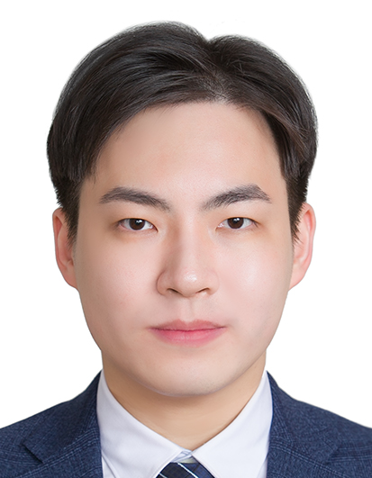

<h1>황준오 Juno Hwang</h1>
<h2>Contact</h2>

서울대학교 물리교육과 데이터사이언스연구실 
wnsdh10@snu.ac.kr

Keywords  Statistical physics · Data science · Physics education · Learning science · Diffusion models

## Education

서울대학교 물리교육과 데이터사이언스연구실 석박사통합과정 (박사수료) (2021–현재)

서울대학교 계산과학 연합전공 학사 (2021)
 - 얼굴 및 시선인식 기반 마우스 제어

서울대학교 물리교육과 학사 (2021)
 - 저차원형 관악기의 저주파 공명에 대한 주변 경계조건 근사방법 · [PDF](undergraduate_thesis.pdf)

## Career

박사 전문연구요원 (2024-, 현재 유예학기)

(주)엘박스 (LBOX Co., Ltd.) Research intern (2021 Dec – 2022 Feb)
 - 법률 문서 이미지 증강 및 분류, OCR 보정 알고리즘 개발

(주)비트겐 (Vittgen Inc.) Technical director (2017 – 2020)
 - 게임 및 인터랙티브 미디어 개발 총괄

## Certificate

교원 자격증 (물리 2급 정교사) (2021)

## Teaching experience

서울대 과학교육과 대학원 <과학교육포럼> 강사 (2026)

서울대 물리교육과 <전산물리 및 교육> 강의 조교 (2023)

서울대 기초교육원 <컴퓨팅 기초> 총괄조교 (2019–2023)

## Papers

*Leveraging learning analytics to enhance immersive teacher simulations: Challenges and opportunities* (2026)
 - S. Hong, J. Moon, T. Eom, J. Hwang & J. Seo · Preprint (arXiv) · [PDF](https://arxiv.org/pdf/2601.08954.pdf)

*Generative AI-Enhanced Virtual Reality Simulation for Pre-Service Teacher Education: A Mixed-Methods Analysis of Usability and Instructional Utility for Course Integration* (2025)
 - S. Hong, J. Moon, T. Eom, I. D. Awoyemi & J. Hwang · Education Sciences (MDPI) · [DOI](https://doi.org/10.3390/educsci15080997)

*Effect of AI-Powered Virtual Reality Simulation on Pre-Service Teachers' Empathy towards Multicultural Students* (2025)
 - Y. Xie, J. Hwang, A. Kim, H. Kim & Y. H. Cho · International Conference of the Learning Sciences (ICLS) 2025 · [DOI](https://doi.org/10.22318/icls2025.113259) · [PDF](https://repository.isls.org/handle/1/11445)

*Enhancing Pre-service Teachers' Competence with a Generative Artificial Intelligence-Enhanced Virtual Reality Simulation* (2024)
 - J. Hwang, S. Hong, T. Eom & C. Lim · International Society of the Learning Sciences (ISLS) Annual Meeting 2024 · [Proceedings](https://2024.isls.org/proceedings/)

*Upsample Guidance: Scaling Diffusion Models without Retraining* (2026)
 - J. Hwang, Y. H. Park & J. Jo · IEEE Access 제출 및 심사 중 · Preprint (arXiv) · [PDF](https://arxiv.org/pdf/2404.01709.pdf)

*Resolution chromatography of diffusion models* (2023)
 - J. Hwang, Y. H. Park & J. Jo · Preprint (arXiv) · [PDF](https://arxiv.org/pdf/2401.10247.pdf)

*Mirror descent of Hopfield model* (2023)
 - H. Soh, D. Kim, J. Hwang & J. Jo · Neural Computation (MIT Press) · [DOI](https://doi.org/10.1162/neco_a_01602)

*Tractable loss function and color image generation of multinary restricted Boltzmann machine* (2020)
 - J. Hwang, W. S. Hwang & J. Jo · NeurIPS 2020 DiffCVGP Workshop · [PDF](https://arxiv.org/pdf/2011.13509.pdf)

## Books & Chapters

*Leveraging learning analytics to enhance immersive teacher simulations: Challenges and opportunities* (forthcoming)
 - S. Hong, T. Eom, J. Hwang & J. Seo · *Innovations in Immersive Learning for Teacher Education: International Perspective* · Springer · Accepted

*Immersive and Engaging Design for Teacher Simulation: Theoretical Foundations and Innovative Approaches* (2026)
 - S. Hong, J. Moon, T. Eom, J. Hwang, J. Lim & S. Park · In P. Trifonas (Ed.), *International Handbook of Theory and Research in Digital Media and Education* · Springer · [Handbook (Springer)](https://link.springer.com/book/9783032060631)

*수능 국어 비법서 스키마 개념사전: 과학 · 기술* (2022)
 - 이영택, 김경민, 최윤옥, 한지원, 황준오, 이연규, 김예나, 이유진, 김인태 · 수능 독서 지문에 필요한 스키마(주제별 배경지식)와 필수 개념, 연습 · 형설EMJ · [교보문고](https://product.kyobobook.co.kr/detail/S000061585941)

## Invited Talks & Lectures

*The 17th KIAS CAC Summer School on Parallel Computing and Artificial Intelligence* (Seoul, 2026)
 - 실습조교 · 인공지능을 활용한 코딩 및 계산 자동화

*The 15th KIAS CAC Summer School on Parallel Computing and Artificial Intelligence* (Seoul, 2024)
 - 실습조교 · Diffusion models

*The 14th KIAS CAC Summer School on Parallel Computing and Artificial Intelligence* (Seoul, 2023)
 - 실습조교 · 확산 생성모형의 이론과 실습

*KIAS Winter School for Physics and Machine Learning* (Online, 2022)  
 - 볼츠만머신의 일반화와 확장모형 [Link](http://events.kias.re.kr/h/physAI/?pageNo=4589)

*현대엔지니어링 사내 AI 연구회 초청강연* (Seoul, 2019)

## Conference Presentations

*Nonequilibrium Gated Simulated Annealing* (2026)
 - 황준오, 조정효 · 2026 한국물리학회 봄 학술대회 (KPS Spring Meeting) · Daejeon

*Facilitating High School Students' Scientific Modeling through Interaction with AI Chatbots with Varied Personas* (2024)
 - H. K. Park, J. Hwang, S. Hong, & S. N. Martin · International Conference on Science Education in the Infosphere · Seoul

*Enhancing Pre-service Teachers' Competence with a Generative Artificial Intelligence-Enhanced Virtual Reality Simulation* (2024)
 - J. Hwang, S. Hong, T. Eom & C. Lim · International Society of the Learning Sciences Annual Meeting · Buffalo

*유기염료 SERS 신호의 기계학습 기반 분류를 위한 노이즈 및 세기 강건성을 지닌 피크 검출법* (2024)
 - 황준오, 이동하, 곽성준, 김경훈, 정대홍, 조정효 · 한국문화재보존과학회 춘계학술대회 · Seoul

*Mode Separating Property of Restricted Boltzmann Machines* (2024)
 - 황준오, 조정효 · 2024 한국물리학회 봄 학술대회 (KPS Spring Meeting) · Daejeon

*Resolution Chromatography of Diffusion Models* (2023)
 - 황준오, 박용현, 조정효 · KIAS Center for AI and Natural Sciences Winter Workshop · Gangwon

*예비교원의 교수 역량 향상을 위한 생성형 AI 기반의 가상현실 수업 시뮬레이션 개발* (2023)
 - 황준오, 홍수민, 엄태연, 임철일 · 한국교육공학회·한국교육정보미디어학회 추계공동학술대회 · Seoul

*실시간 원격 물리량 데이터 수집을 통한 용수철운동 수업 설계 및 적용 사례 분석* (2022)
 - 황준오, 조정효 · 한국현장과학교육학회 정기학술대회 · Siheung

*Tractable Loss Function and Color Image Generation of Multinary Restricted Boltzmann Machine* (2021)
 - 황준오, 조정효 · APCTP Workshop for Physics and Machine Learning · Jeju

*Visualization of Real Magnetic Field Using Sensor and AR* (2018)
 - J. Yoo, J. Park, D. Lee, S. Jin & J. Hwang · American Association of Physics Teachers Winter Meeting · California

## Research Projects

석조문화유산의 AI 기반 기후변화 대응형 열화 예측 기술 개발 (2026.04–현재)
 - 국립문화유산연구원

시계열의 인과추론 (2022.12–2026.02)
 - 과학기술정보통신부

유기색료의 in-situ 분석·진단·열화예측 기술 개발 (2021.07–2026.02)
 - 국립문화재연구소

디지털 환경에서 영어 학습 과정 분석을 위한 웹캠기반 안구추적 프로그램 개발 및 적용 (2024.12–2025.12)
 - 서울대학교

지능정보기술 기반 미래교육 혁신과 블렌디드 창의융합교육 (2021.06–2025.03)
 - 한국과학창의재단

다문화 교육 역량을 위한 가상현실 시뮬레이션 개발 연구 (2023.12–2024.02)
 - 서울대학교

대학원 공통교과목화를 위한 수정 과제 - 인공지능 융합교육을 위한 기계학습 입문 (2023.12–2024.01)
 - 서울대학교

사범대학 예비교원의 교수 역량 향상을 위한 가상현실 수업 시뮬레이션 개발 (2023.06–2023.08)
 - 서울대학교

학부 물리교육 시범실험을 위한 VR 시뮬레이션 환경 개발 (2022.11–2023.02)
 - 서울대학교

시계열 데이터의 동역학 추론 (2020.01–2022.11)
 - 한국연구재단

## Development

*Exploring Digital Learning Processes through Webcam-Based Eye Tracking: Development and Applications of SNUWET.* (2025)
 - 웹브라우저에서 실행 가능한 웹캠 기반 화면녹화 및 AI 시선추적 동시 자동화 플랫폼 · [Website](https://snuwet.github.io/)

*Juno-DKT (Deep Knowledge Tracing) pytorch implementation* (2019)
 - 심층 지식추적(Deep Knowledge Tracing)의 PyTorch 구현체 · [GitHub](https://github.com/juno-hwang/Juno-DKT)

## Awards

*한국교육공학회·한국교육정보미디어학회 추계공동학술대회 최우수상* (2023)
 - 예비교원의 교수 역량 향상을 위한 생성형 AI 기반의 가상현실 수업 시뮬레이션 개발 · [시상식 영상](https://youtu.be/mnv9-1i1rt8?si=HV5z7iU_6l8ZU0iS&t=402)

*KIAS Winter School for Physics and Machine Learning 우수프로젝트상* (2022)
 - XY Model in Two Dimension & Coarse Graining via Convolutional RBM

*한국동서발전 빅데이터·AI 경진대회 입상* (2018)
 - 기후별 태양광 발전량 예측 모델

*KAIST 웨어러블 컴퓨터 경진대회 우수상* (2016)
 - Team Gorany - 근전도 및 IMU센서 기반 전자악기 LauchWare · [데모 영상](https://www.youtube.com/watch?v=_OAI75a8nxA)

*미래창조과학부 빅데이터 페어 최우수상* (2013)
 - 개봉전 사전반응에 기반한 영화 일별 관객 예측 알고리즘 · [YTN뉴스](https://www.ytn.co.kr/_ln/0105_201312190441553317)

*Korea Wi.Content Contest 은상* (2012)
 - 게임개발 부문 <어메이징 쉬리> · [수상작 목록](http://www.21kwc.com/wi/sub06/2013.html)