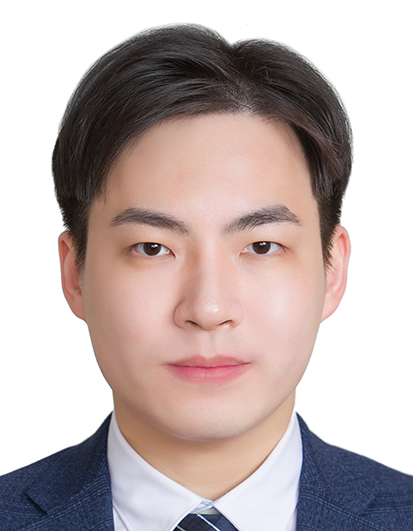

<h1>Juno Hwang (황준오)</h1>
<h2>Contact</h2>

Data Science Lab, Department of Physics Education, Seoul National University 
wnsdh10@snu.ac.kr

Keywords Statistical physics · Data science · Physics education · Learning science · Diffusion models

## Education

Seoul National University — Integrated M.S./Ph.D. program (Ph.D. coursework completed), Data Science Lab, Department of Physics Education (2021–present)

Seoul National University — B.S., Computational Science (joint major) (2021)
 - Face- and gaze-tracking mouse system · [Video](https://www.youtube.com/watch?v=RCH1CgKhJyg)

Seoul National University — B.S., Physics Education (2021)
 - Approximate boundary conditions for low-frequency resonance of low-dimensional wind instruments · [PDF](undergraduate_thesis.pdf)

## Career

Professional researcher (doctoral-level substitute national service) (2024–; currently on a deferral semester)

LBox Co., Ltd. — Research intern (Dec 2021 – Feb 2022)
 - Legal document image augmentation and classification; OCR correction algorithms

## Certificate

Secondary school teacher certificate (Level 2), Physics (2021)

## Teaching experience

SNU Graduate School of Science Education, *Science Education Forum* — Instructor (2026)

SNU Department of Physics Education, *Computational Physics and Education* — Teaching assistant (2023)

SNU Center for Liberal Education, *Introduction to Computing* — Head TA (2019–2023)

## Papers

*Leveraging learning analytics to enhance immersive teacher simulations: Challenges and opportunities* (2026)
 - S. Hong, J. Moon, T. Eom, J. Hwang & J. Seo · Preprint (arXiv) · [PDF](https://arxiv.org/pdf/2601.08954.pdf)

*Generative AI-Enhanced Virtual Reality Simulation for Pre-Service Teacher Education: A Mixed-Methods Analysis of Usability and Instructional Utility for Course Integration* (2025)
 - S. Hong, J. Moon, T. Eom, I. D. Awoyemi & J. Hwang · Education Sciences (MDPI) · [DOI](https://doi.org/10.3390/educsci15080997)

*Effect of AI-Powered Virtual Reality Simulation on Pre-Service Teachers' Empathy towards Multicultural Students* (2025)
 - Y. Xie, J. Hwang, A. Kim, H. Kim & Y. H. Cho · International Conference of the Learning Sciences (ICLS) 2025 · [DOI](https://doi.org/10.22318/icls2025.113259) · [PDF](https://repository.isls.org/handle/1/11445)

*Enhancing Pre-service Teachers' Competence with a Generative Artificial Intelligence-Enhanced Virtual Reality Simulation* (2024)
 - J. Hwang, S. Hong, T. Eom & C. Lim · International Society of the Learning Sciences (ISLS) Annual Meeting 2024 · [Proceedings](https://2024.isls.org/proceedings/)

*Upsample guidance: Scale up diffusion models without training* (2024)
 - J. Hwang, Y. H. Park & J. Jo · Preprint (arXiv) · [PDF](https://arxiv.org/pdf/2404.01709.pdf)

*Resolution chromatography of diffusion models* (2023)
 - J. Hwang, Y. H. Park & J. Jo · Preprint (arXiv) · [PDF](https://arxiv.org/pdf/2401.10247.pdf)

*Mirror descent of Hopfield model* (2023)
 - H. Soh, D. Kim, J. Hwang & J. Jo · Neural Computation (MIT Press) · [DOI](https://doi.org/10.1162/neco_a_01602)

*Tractable loss function and color image generation of multinary restricted Boltzmann machine* (2020)
 - J. Hwang, W. S. Hwang & J. Jo · NeurIPS 2020 DiffCVGP Workshop · [PDF](https://arxiv.org/pdf/2011.13509.pdf)

## Books & Chapters

*Immersive and Engaging Design for Teacher Simulation: Theoretical Foundations and Innovative Approaches* (2026)
 - S. Hong, J. Moon, T. Eom, J. Hwang, J. Lim & S. Park · In P. Trifonas (Ed.), *International Handbook of Theory and Research in Digital Media and Education* · Springer · [Handbook (Springer)](https://link.springer.com/book/9783032060631)

*Nonbibeoseo: Schema Concept Dictionary — Science & Technology* (2022)
 - Y.-T. Lee, K.-M. Kim, Y.-O. Choi, J.-W. Han, J. Hwang, Y.-G. Lee, Y.-N. Kim, Y.-J. Lee & I.-T. Kim · Schema (topic-wise background knowledge) and essential concepts with practice for CSAT Korean reading passages · Hyongseol EMJ · [Kyobo Book Centre](https://product.kyobobook.co.kr/detail/S000061585941)

## Invited Talks

*KIAS CAC Summer School on the Parallel Computing and Artificial Intelligence* (Seoul, 2024)  

*KIAS CAC Summer School on the Parallel Computing and Artificial Intelligence* (Seoul, 2023)  

*KIAS Center for AI and Natural Sciences Winter Workshop* (Gangwon, 2023)  

*KIAS Winter School for Physics and Machine Learning* (Online, 2022)  
- Special lecture — Generalization and extended models of Boltzmann machines [Link](http://events.kias.re.kr/h/physAI/?pageNo=4589)

*APCTP Workshop for Physics and Machine Learning* (Jeju, 2021)

*Invited talk, in-house AI research seminar, Hyundai Engineering* (Seoul, 2019)

## Conference Presentations

*Facilitating High School Students' Scientific Modeling through Interaction with AI Chatbots with Varied Personas* (2024)
 - H. K. Park, J. Hwang, S. Hong, & S. N. Martin · International Conference on Science Education in the Infosphere · Seoul

*Enhancing Pre-service Teachers' Competence with a Generative Artificial Intelligence-Enhanced Virtual Reality Simulation* (2024)
 - J. Hwang, S. Hong, T. Eom & C. Lim · International Society of the Learning Sciences Annual Meeting · Buffalo

*Noise- and intensity-robust peak detection for machine-learning-based classification of organic dye SERS signals* (2024)
 - J. Hwang, D. Lee, S. Kwak, K. Kim, D. Jeong & J. Cho · Spring Conference, Korean Society for Conservation Science of Cultural Heritage · Seoul

*Development of a generative AI-based virtual reality lesson simulation for enhancing pre-service teachers' teaching competency* (2023)
 - J. Hwang, S. Hong, T. Eom & C. Lim · Joint Fall Conference, Korean Society for Educational Technology & Korean Society for Information and Media in Education · Seoul

*Lesson design and a case study on spring motion using real-time remote physics data collection* (2022)
 - J. Hwang & J. Cho · Regular Conference, The Korean Society for School Science · Siheung

*Visualization of Real Magnetic Field Using Sensor and AR* (2018)
 - J. Yoo, J. Park, D. Lee, S. Jin & J. Hwang · American Association of Physics Teachers Winter Meeting · California

## Development

## Awards

*Best Paper Award, Korean Society for Educational Technology & Korean Society for Information and Media in Education (Joint Fall Conference)* (2023)
 - Development of a generative AI-based virtual reality lesson simulation for enhancing pre-service teachers' teaching competency · [Award ceremony video](https://youtu.be/mnv9-1i1rt8?si=Xd8lQmd9TpTKcPhG)

*Big Data & AI Competition, Korea East-West Power Co. (prize winner)* (2018)
 - Solar power generation forecasting by climate zone

*Wearable Computer Competition, KAIST (Excellence Award)* (2016)
 - Team Gorany — Electromyography and IMU sensor-based electronic instrument LaunchWare · [Demo video](https://www.youtube.com/watch?v=_OAI75a8nxA)

*Big Data Fair, Ministry of Science, ICT and Future Planning (1st place)* (2013)
 - Daily movie audience prediction from pre-release signals · [YTN News](https://www.ytn.co.kr/_ln/0105_201312190441553317)

*Korea Wi.Content Contest (Silver)* (2012)
 - Game development — *Amazing Shiri* · [List of winners](http://www.21kwc.com/wi/sub06/2013.html)
